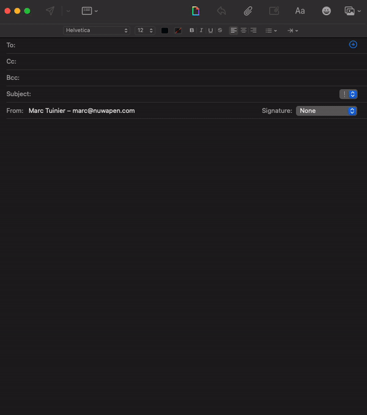

# GiphyMailExtension

> A native macOS Mail extension to search and insert GIFs from Giphy directly into your emails.

[](https://swift.org)
[](https://www.apple.com/macos)
[](LICENSE)
[](https://giphy.com)



## About

GiphyMailExtension adds a Giphy search panel to Apple Mail's compose window. Search for any GIF, then drag and drop it directly into your email — no copy-pasting URLs or downloading files.

## Features

- Search the entire Giphy library from within Mail's compose window
- Preview GIF results in a scrollable grid
- Drag and drop GIFs directly into your email
- Debounced search to keep things responsive
- Sandboxed and privacy-respecting — only makes network requests to the Giphy API

## Requirements

- macOS 14.0 (Sonoma) or later

## Installation

1. Go to the [**Releases**](https://github.com/marctuinier/GiphyMailExtension/releases) page.
2. Download the latest `.dmg` file.
3. Open the DMG and drag **GIFMailSix** into your **Applications** folder.
4. Launch GIFMailSix once to register the extension.
5. Open **System Settings → General → Login Items & Extensions → Mail Extensions**.
6. Enable **GIFMailSixExtension**.

> **Note:** Since this app is not from the App Store, you may need to right-click the app and select **Open** on the first launch. If that doesn't work, go to **System Settings > Privacy & Security > Open Anyway**.

## Usage

1. Open Apple Mail and compose a new message.
2. Click the **Giphy** icon in the compose toolbar.
3. Type your search query.
4. Click and drag a GIF into the email body.

## Building from Source

1. Clone the repository:
   ```bash
   git clone https://github.com/marctuinier/GiphyMailExtension.git
   ```
2. Open `GIFMailSix.xcodeproj` in Xcode.
3. Build and run (`Cmd + R`).

## Project Structure

```
GIFMailSix/                     # Host application (SwiftUI)
├── GIFMailSixApp.swift
└── ContentView.swift

GIFMailSixExtension/            # Mail extension (AppKit + MailKit)
├── MailExtension.swift         # MEExtension entry point
├── ComposeSessionHandler.swift # MEComposeSessionHandler
├── ComposeSessionViewController.swift
├── APIClient.swift             # Giphy API client
├── YourGifCollectionViewItem.swift
└── Info.plist
```

## License

This project is licensed under the [MIT License](LICENSE).
